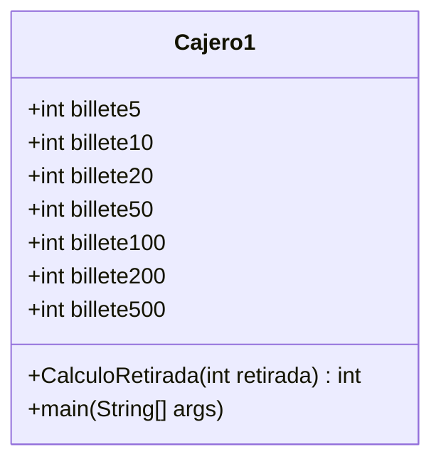

# Ejercicios semana séptima

[cajero_sin_metodo](https://github.com/angelaserantes/ejercicio_semana_septima/blob/main/src/com/ejercicios/SemanaSeptima/Cajero.java)

[cajero_con_metodo](https://github.com/angelaserantes/ejercicio_semana_septima/blob/main/src/com/ejercicios/SemanaSeptima/Cajero1.java)

## diagrama de clase



## diagrama de flujo
```mermaid
flowchart
    id1((inicio))--> id2[\Bienvenido al cajero\]
    id2-->id3[\Qué cantidad desea retirar\]-->id4[/retirada/]
    id4-->id5(CalculoRetirada)
    id5-->id6{retirada%5==0}
    id6-->|no|id7[\La cantidad introducida no se puede retirar\]
    id7-->id1
    id6-->|si|id8{retirada>=5}
    id8-->|si|id9{retirada>=500}
    id9-->id10(banco.billete500++ y retirada= retirada -500)
    id10-->|no|id11{retirada >=200 && retirada<500}
    id11-->|no|id12{retirada >=100 && retirada<200}
    id12-->|no|id13{retirada >=50 && retirada<100}
    id13-->|no|id14{retirada >=20 && retirada<50}
    id14-->|no|id15{retirada >=10 && retirada<20}
    id15-->|no|id16{retirada>=5 && retirada<10}
    id11-->id17(banco.billete200++ y retirada = retirada-200)
    id12-->id18( banco.billete100++ y  retirada = retirada-100)
    id13-->id19(banco.billete50++ y retirada = retirada-50)
    id14-->id20(banco.billete20++ y retirada = retirada-20)
    id15-->id21(banco.billete10++ y retirada = retirada-10)
    id16-->id22(banco.billete5++ y retirada = retirada-5)
   id22-->id8
   id8-->|no|id23{banco.billete500>=1}
   id23-->id24[\Tienes + banco.billete500 + billetes de 500\]
   id24-->|no|id25{banco.billete200>=1}
   id25-->id26[\Tienes + banco.billete200 + billetes de 200\]
   id26-->|no|id27{banco.billete100>=1}
   id27-->id28[\Tienes + banco.billete100 + billetes de 100\]
   id28-->|no|id29{banco.billete50>=1}
   id29-->id30[\Tienes + banco.billete50 + billetes de 50\]
   id30-->|no|id31{banco.billete20>=1}
   id31-->id32[\Tienes + banco.billete20 + billetes de 20\]
   id32-->|no|id33{banco.billete10>=1}
   id33-->id34[\Tienes + banco.billete10 + billetes de 10\]
   id34-->id35{banco.billete5>=1}
   id35-->id36[\Tienes + banco.billete5 + billetes de 5\]
   id36----->|no|id37((fin))