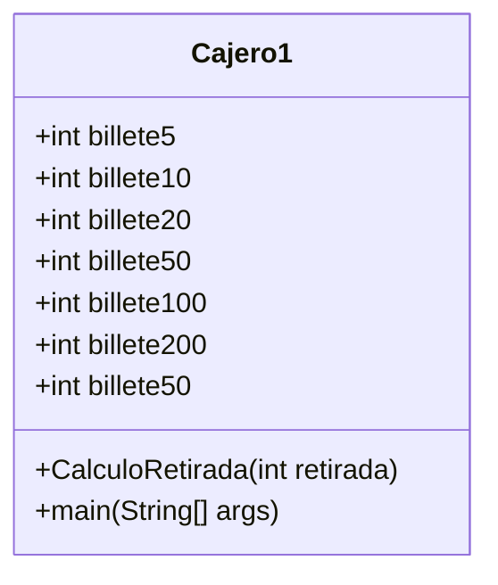

# Ejercicios semana séptima

[cajero_sin_metodo](https://github.com/angelaserantes/ejercicio_semana_septima/blob/main/src/com/ejercicios/SemanaSeptima/Cajero.java)

[cajero_con_metodo](https://github.com/angelaserantes/ejercicio_semana_septima/blob/main/src/com/ejercicios/SemanaSeptima/Cajero1.java)

## diagrama de clase

